# Docker Desktop Application Installation

The download link can be found at Dockers site on the [Get Started](https://www.docker.com/get-started) page.

## Installation

1. Navigate to the [Docker Get Started](https://www.docker.com/get-started) page.
1. Scroll down to the **Docker for Developers** section and click on the **Download Desktop and Take a Tutorial** button on the right side of the page.

    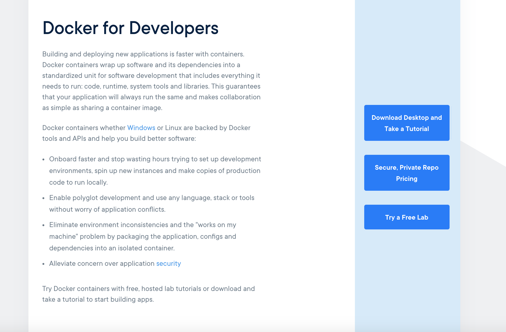

1. Create an account with Docker Hub.
    - The Docker ID is the username that docker will use to identify you. This has to be all lowercase with no spaces.

    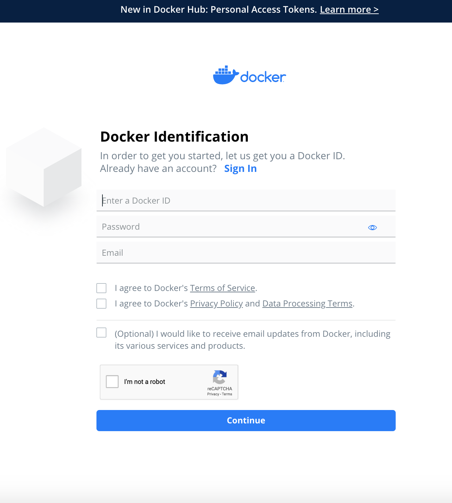

1. Automatically taken to a page to fill out your profile information.

    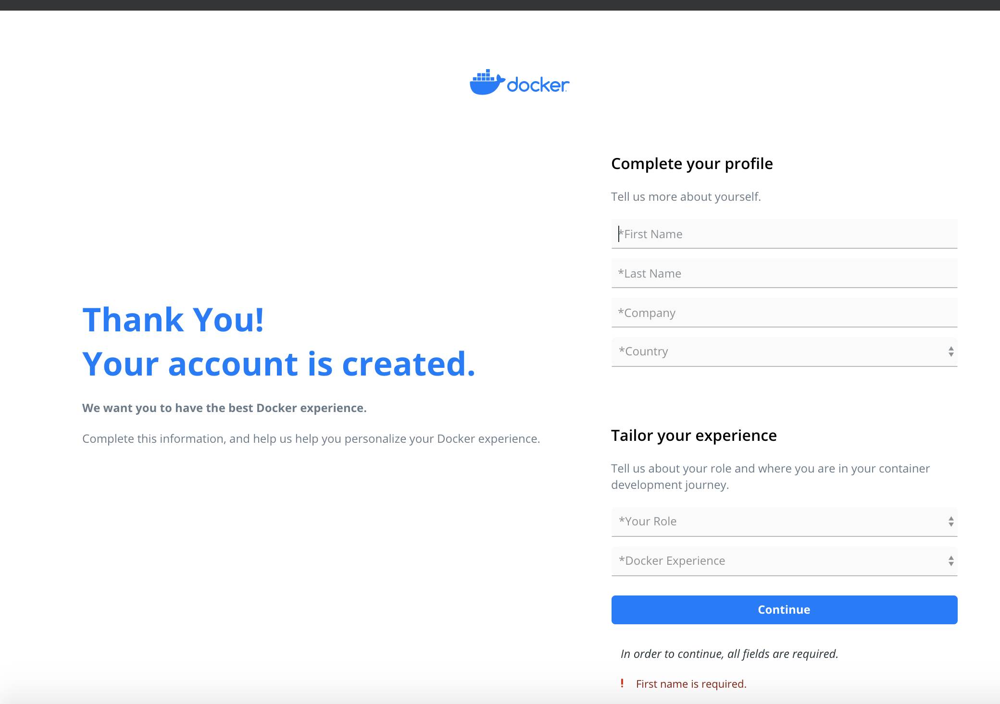

1. A notice will be presented prompting you to confirm your email.

    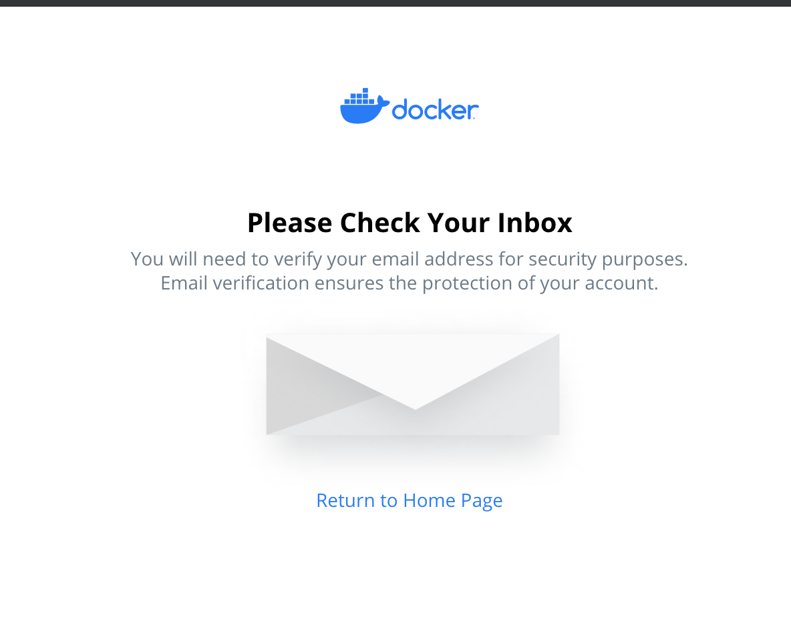

1. Go to your email and confirm your email by clicking on the **Confirm Your Email With Docker** button.

    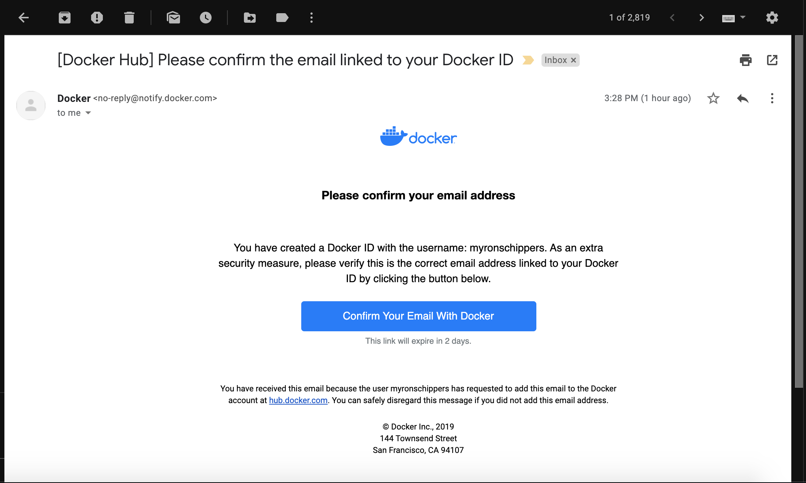

1. When the email bounces you back to the Docker Hub site it may prompt you to login or automatically log you in but a download screen will come up for you and you will need to click on the **Download Docker Desktop for Mac**.

    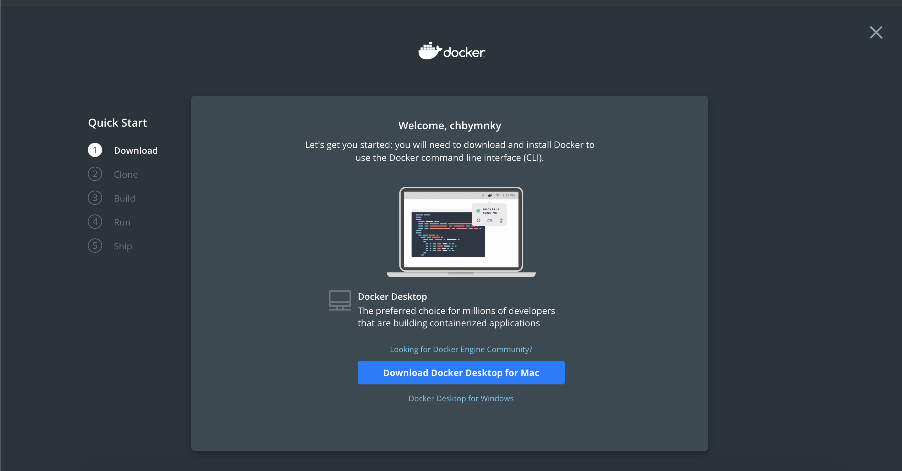

1. In the bottom left corner of your browser an icon will show up indicating that the **Docker.dmg** file is downloading.

    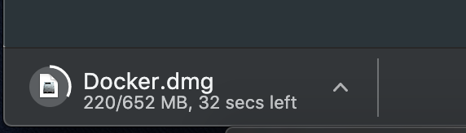

1. After downloading is complete go into the **Downloads** folder in your Finder. Double click on the **Docker.dmg** file to initialize the Docker installation.

    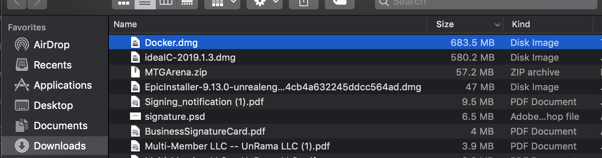

1. You will get an indicator saying that the **Docker.dmg** is opening.

    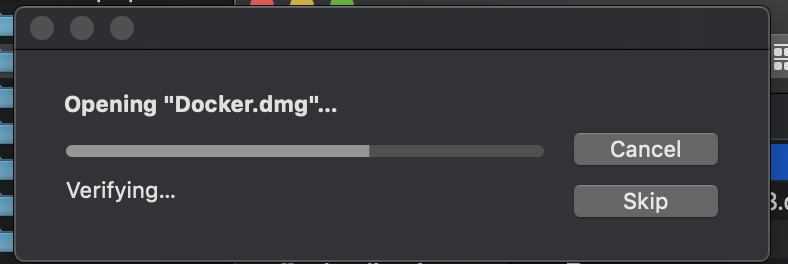

1. Before installation starts you will get prompted with a warning message as seen in the below screen shot. Go ahead and click the **Open** button.

    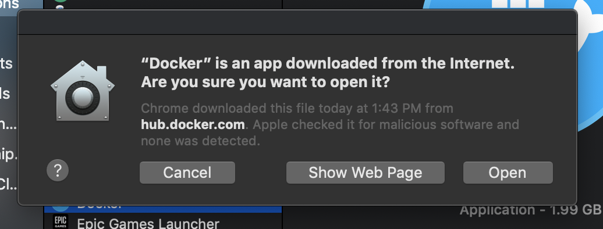

1. A new message asking if you will allow Docker the access to your computer that it needs in order to run. Read the message fully and then click on the **OK** button.

    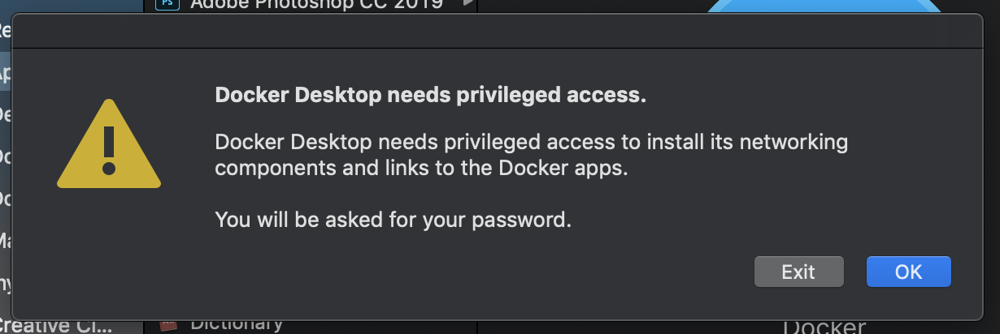

1. After you have allowed access your computer will verify docker.

    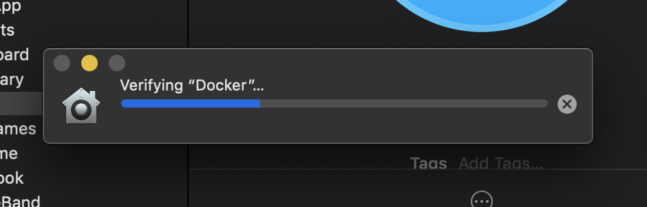

1. Once verified a window will show up asking you to drag the Docker application icon into the Application folder icon. Please go ahead and drag it over.

    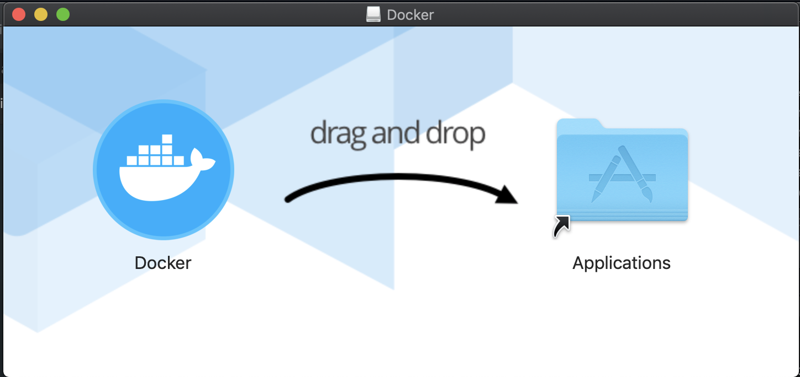

1. We'll have to wait for **Docker** to be copied over to **Applications**.

    

1. Navigate to the application folder and double click on the Docker application icon in order to open the desktop application.

    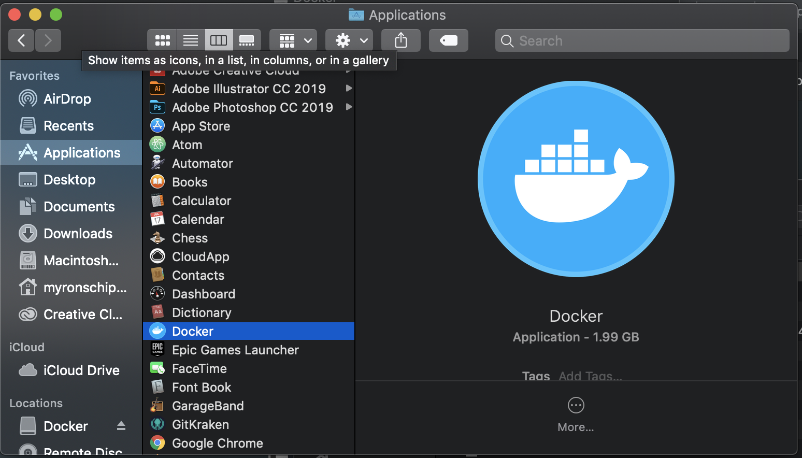

1. You will not see an application window open up but instead an icon for Docker will be added to the toolbar at the top of your laptop window and a popover window will be opened up asking you to login with the account you have just created.

    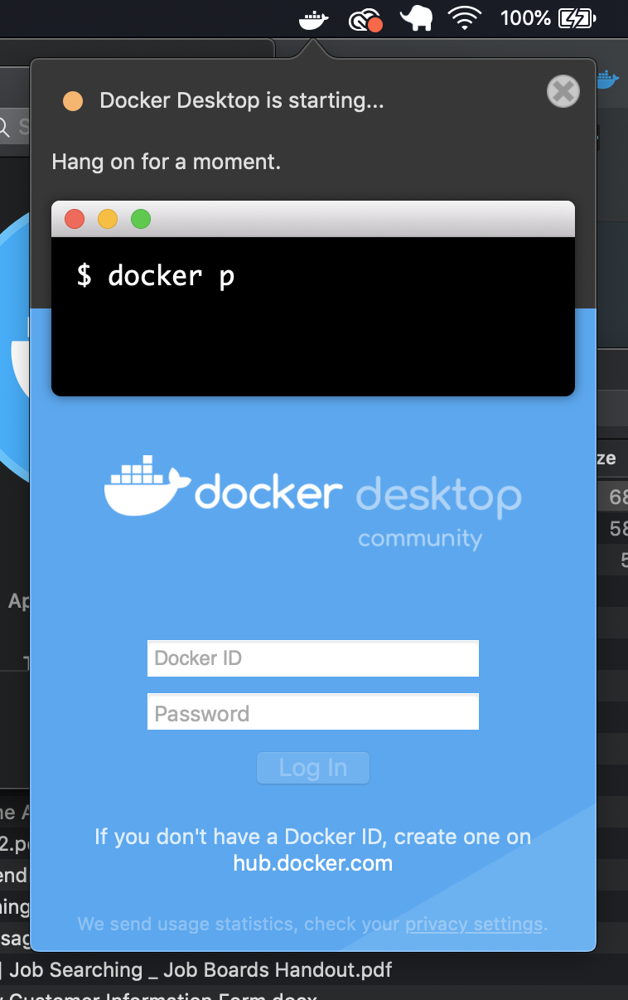

1. Now you are completely downloaded and the docker command line tools have been automatically installed on your machine as well. In order to access the application in the future you can use the Docker icon now available in the the toolbar at the top right of your screen.

    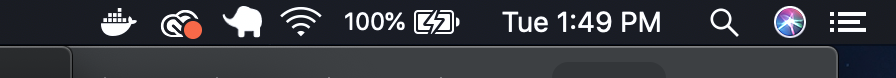